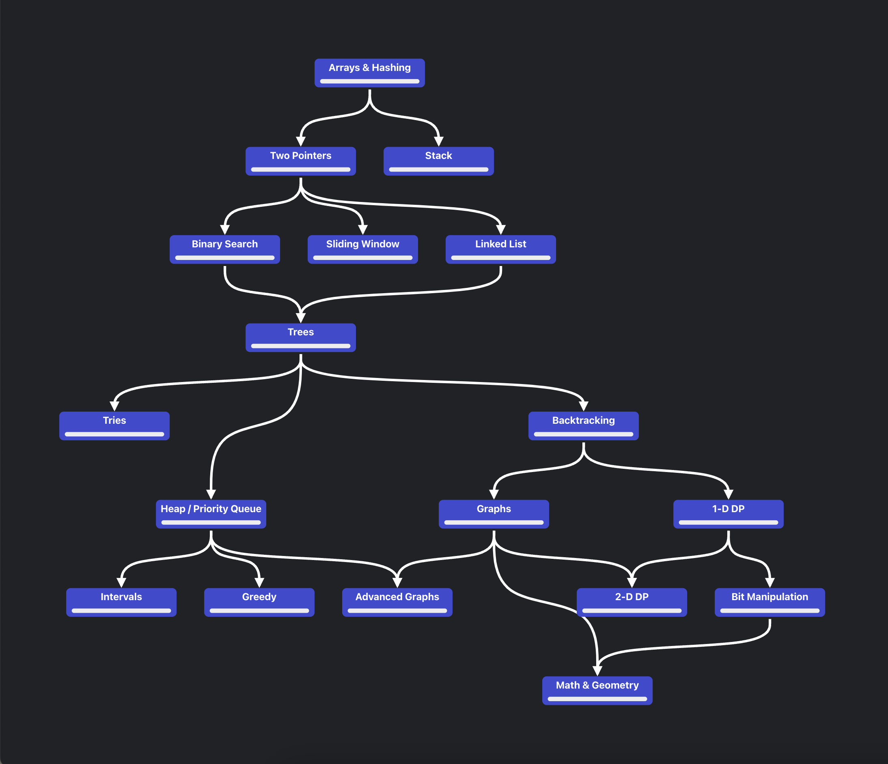

## Leetcode Problem Roadmap

Welcome to the Leetcode Problem Roadmap! This readme provides an overview of the categories and subcategories of problems that I am following in my Leetcode journey.

Refer to the screenshot for the actual roadmap of problems I am following.

### Arrays & Hashing

| Status  | No.  | Problem                      | Code                                               |
| ------- | ---- | ---------------------------- | -------------------------------------------------- |
| &check; | 217. | Contains Duplicate           | [Solution](./217.%20Contains%20Duplicate/index.ts) |
| &check; | 242. | Valid Anagram                | [Solution](./242.%20Valid%20Anagram/index.ts)      |
| &check; | 1.   | Two Sum                      | [Solution](./1.%20Two%20Sum/index.ts)              |
| &cross; | 49.  | Group Anagrams               | Solution                                           |
| &cross; | 347. | Top K Frequent Elements      | Solution                                           |
| &cross; | 238. | Product of Array Except Self | Solution                                           |
| &cross; | 36.  | Valid Sudoku                 | Solution                                           |
| &cross; | 271. | Encode and Decode Strings    | Solution                                           |
| &cross; | 128. | Longest Consecutive Sequence | Solution                                           |
